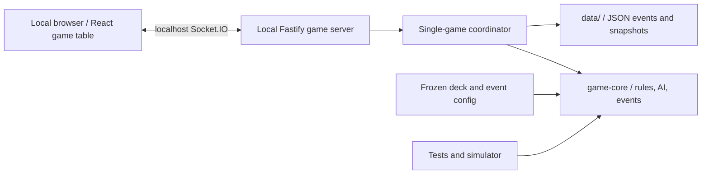

# Chews Freedom / *King of Nutritionists*
## English Game Design and Local-MVP Execution Guide

**Translation status:** English source-of-truth for project review and implementation.  
**Rule baseline:** `2.0-codex-1` (`Chews_Freedom_V2_Codex_Spec.md`).  
**Current build plan:** `3.0-local-mvp-draft.5-player-chosen-rescue-target` (`Chews_Freedom_Local_MVP_Engineering_Plan.md`, locally amended by the accepted recovery-chain rule below).  
**Updated:** 16 July 2026.

> The Chinese source files remain in this pack as archival originals. This guide translates and consolidates their substantive game-design, engineering-execution, visual-design, validation, and product-scope requirements. The Word document is a formatted reading copy of the same V2 baseline.

---

## 1. What this project is

Chews Freedom is a cooperative, educational four-seat game about managing food values for children with rare metabolic conditions. It is not medical advice, a treatment recommendation, or a simulation of an individual child's diet. Players calculate food values, help the patients who are over their limit, cooperate with one another, and use a shared vegetable garden only as a final zero-point safety resource.

The educational aims are to help players recognize dietary risk, understand individualized nutritional needs, practise asking for and giving help, develop autonomy in choosing food, and understand that eating differently does not make someone less able to enjoy life.

The game has individual points, but it is not zero-sum: a single action can improve a patient's state and create points for several people. All four players' food cards are public in the local MVP, so the game is a shared reasoning and discussion experience.

## 2. Authority, versions, and unresolved material

`Chews_Freedom_V2_Codex_Spec.md` is the normative V2 rules baseline. Its machine-readable companion is `chews_freedom_v2_config.json`, and `reference_simulator.py` is the executable reference for the baseline rules and balance regression.

The local MVP changes the delivery order and introduces two explicit draft changes:

1. It is a local browser game first: 0–4 humans may play on one computer and any empty seats are deterministic AI. It does **not** begin with online rooms, accounts, matchmaking, databases, or cloud deployment.
2. The garden is a visible, player-controlled recovery phase. Players click a highlighted highest-value food card on the currently most-over-limit patient to take one temporary value-0 vegetable. They repeat this step until every patient is compliant or the garden is empty; an empty garden ends the game and the UI explains whether recovery was completed.

V2 itself has events disabled. The local MVP requires a one-event-per-round framework, but no event may be enabled until its numeric effects, resolution rule, content source, and AI policy are approved and frozen. Do not invent disease content, nutrition advice, event values, board movement, dice values, commercial card copy, or medical claims.

## 3. Core game model

### Fixed parameters

| Item | Value |
|---|---:|
| Seats / players | 4 |
| Cards per hand | 3 |
| Cards dealt per round | 12 |
| Patient threshold | 10 |
| Main deck | 48 cards |
| Starting vegetable tokens | 10 |
| Vegetable replacement value | 0 |
| Normal reshuffle interval | 4 rounds |
| Successful active nutritionist rescue | 1 point |
| Successful assistant rescue | 1 point |
| Both patients compliant after their swap | 2 points each |
| Exactly one patient compliant after their swap | 1 point each |
| Vegetable replacement | 0 points |

The 48-card main deck must contain exactly: 0×6, 1×4, 2×7, 3×7, 5×7, 7×13, and 9×4. Each physical/logical main-deck card requires a unique `card_id`; cards of equal value have the same rules effect but IDs are necessary for logs, replay, deterministic ties, and swap tests.

The six zero-value main-deck cards are ordinary food cards. The ten vegetable tokens are a separate shared resource and are never part of the 48-card deck. A vegetable replaces a main-deck card only for the current round with a temporary zero-value card; the displaced main card is discarded, the temporary vegetable disappears at round end, and spent tokens never return.

### Seats and rotating roles

Seats rotate clockwise: `0 → 1 → 2 → 3 → 0`. If the active nutritionist is seat `A`, then:

```text
active_nutritionist    = A
assistant_nutritionist = (A + 2) mod 4
patient_1              = (A + 1) mod 4   # clockwise neighbour
patient_2              = (A + 3) mod 4   # counter-clockwise neighbour
```

The initial active seat must be chosen uniformly at random unless explicitly supplied. After every round, the active seat advances one position. A four-round cycle gives each person one active role, one assistant role, and two patient roles.

### Compliance, rescue choice, and garden priority

A patient's total is the sum of the three cards in their hand. They are compliant when `total <= threshold`; excess is `max(0, total - threshold)`. The default threshold is 10 and is locked for the entire round. Nutritionists have no compliance check: their own total never affects rescue legality.

For the **garden phase only**, choose exactly one priority patient for the next vegetable:

1. No failing patient: no garden action is needed.
2. One failing patient: that patient is the priority patient.
3. Two failing patients: the patient with greater excess is the priority patient.
4. Equal excess: `patient_1` is the target.

### Local MVP rule update: helpful rescue chain

The local MVP now uses the following accepted recovery chain, which supersedes the V2 immediate-compliance and strict-rescue-target requirements. The active nutritionist chooses either patient who is over the limit, then may exchange exactly one card from their hand for exactly one card from that patient when the incoming card has a lower value than the replaced patient card. This is a **helpful swap** even when it does not immediately make the patient compliant.

The active nutritionist acts first. The assistant then independently chooses either patient who is still over the limit; the assistant may choose the same patient or the other patient. A nutritionist earns 1 point only when their own swap makes their chosen target compliant; a helpful-but-incomplete swap earns no nutritionist point. If both nutritionists and the existing player-controlled patient mutual-aid swap cannot complete recovery, players enter the visible vegetable resolution phase. Equal-value or higher-value incoming cards are not helpful and are illegal.

### Canonical deterministic AI

Human players may choose any legal action. Reproducible simulation, AI seats, timeouts, and official statistics must use `CANONICAL_COOPERATIVE_POLICY_V2`.

- **Active nutritionist:** among helpful swaps for either failing patient, maximize compliant patients after the projected assistant phase; then prefer any assistant rescue that completes compliance; then minimize vegetables needed after the projected patient phase; then minimize remaining excess; then choose the lexicographically smallest action.
- **Assistant:** among helpful swaps for either still-failing patient, maximize compliant patients after the action; then minimize remaining excess; then choose the lexicographically smallest action.
- **Patients:** enumerate the nine card-position swaps and no swap; maximize the patient score tier; then minimize vegetables required; then minimize remaining excess; then prefer no swap when substantive outcomes are equal; then choose lexicographically.

The action ordering should include target seat, both card indices, and both card IDs. Other modes may exist, such as human choice or random legal choice, but official results must record and use the canonical cooperative policy.

### Patient mutual-aid swap

The patient phase occurs only if at least one patient remains non-compliant after both nutritionist phases. The patients may make at most one simultaneous one-for-one swap; unlike a nutritionist rescue, it need not guarantee compliance before execution.

| Outcome after patient swap | Points for patient 1 | Points for patient 2 |
|---|---:|---:|
| Both compliant | 2 | 2 |
| Exactly one compliant | 1 | 1 |
| Neither compliant, or no swap | 0 | 0 |

If both patients are already compliant, this phase must be skipped; no swap is allowed to farm points. A patient swap preserves the two patients' combined total, so both can be compliant only when that combined total is at most 20.

For live human play, use a dual-lock interaction: each patient selects one card or chooses “do not swap”; the swap occurs only after both select a card; either decline skips it; each selection can be withdrawn before lock; an unfinished timeout uses the canonical policy. This is a product interaction layer, not a change to the rules engine.

### Vegetable resolution and game end

After both nutritionist attempts and the patient phase, every still-failing patient enters a visible vegetable resolution phase. Players click an eligible highlighted food card to take exactly one field vegetable; the client and server allow only the highest-value card(s) of the currently most-over-limit patient, so that the shared garden is used efficiently. Each field vegetable is a temporary zero-value card. The players repeat the action until every patient is compliant or the field cannot supply another replacement. For example, `[3,7,9]` becomes compliant by replacing 9 with 0; `[7,7,9]` requires replacing 9 and then one 7.

If both patients require vegetables, prioritize the patient with greater excess, then `patient_1` on a tie, then the highest-value card within that patient's hand. When equal highest-value cards are present, the player may choose either one. Continue accepting player replacements while vegetable tokens remain. If the garden empties before every patient is compliant, log `GARDEN_EXHAUSTED`, commit the round, show the reason, and enter `GAME_OVER`.

### Round state machine

The V2 baseline is:

```text
ROLE_ASSIGNMENT → DEAL → INITIAL_ASSESSMENT → ACTIVE_RESCUE
→ ASSISTANT_RESCUE → PATIENT_SWAP → VEGETABLE_RESOLUTION
→ SCORE_COMMIT → DISCARD → END_CHECK → next round | GAME_OVER
```

Cards are dealt in role order—active, assistant, `patient_1`, `patient_2`—with three cards each. Main-deck cards used in a round enter discard; temporary vegetables leave play. After four event-free baseline rounds, all 48 discarded cards are reshuffled for the next round. The engine must also support a logged emergency reshuffle when future effects make the draw pile insufficient, without ever putting temporary vegetables into it.

The local MVP adds this event envelope before/around the same game phases:

```text
ROUND_START → EVENT_DRAW_BEFORE_DEAL (zero or one) → optional approved event effects
→ DEAL → INITIAL_ASSESSMENT → ACTIVE_RESCUE → ASSISTANT_RESCUE
→ PATIENT_SWAP → VEGETABLE_RESOLUTION → SCORE_COMMIT → DISCARD
→ [GAME_OVER if final vegetable or unresolved event] → expire current-round event
→ END_CHECK → next ROUND_START | GAME_OVER
```

## 4. Scoring, awards, safeguards, and baseline balance

Each player keeps `nutritionist_points`, `patient_mutual_aid_points`, and `total_points`, where the total always equals the two components. Recommended awards are **King of Nutritionists** (highest nutritionist points), **Mutual Aid Star** (highest patient mutual-aid points), and total score as a secondary display. All ties are shared; never break them by vegetable use, seat, last score time, or randomness without an approved new rule.

Every transition must preserve: three logical cards per player while hands are in play; unique main-card locations; 48 main cards across draw, discard, hands, and event areas; vegetables outside that count; vegetable tokens from 0 to 10; non-negative integer scores; equal patient-phase scores for the two patients; one-or-zero nutritionist points per role per round; phase authorization; correct point total; no commands after game end; and idempotent command processing.

The provided V2 reference statistics use 500,000 independent rounds (seed `20260716`) and 30,000 complete games (seed `20260717`), with events disabled and threshold 10. They are archival V2 baselines only. The helpful-rescue chain and spend-all-vegetables rule change the scoring and garden-use distribution, so the local MVP records a new rules version and must not be evaluated against the old V2 balance figures.

## 5. Local MVP: what will be built

The first release is a complete local web game that starts on one computer, opens in a browser, and lets the user choose HUMAN or AI for each of the four fixed seats. It must include public hands, all core phases, AI, events once frozen, scoring, settlement, card/table visuals, keyboard access, mobile layout, event timeline, local export, restart, and restoration of the most recent game.

It explicitly excludes private rooms, invite codes, accounts, friends, online matchmaking, spectators, cross-device synchronization, payments, shops, seasons, chat, native apps, cloud data, Redis/PostgreSQL/Docker, and unapproved content. The online plan is retained as a later-phase reference, not the current delivery order.

The player flow is deliberately simple:

```text
Double-click “Start Local Game” → browser opens localhost:5173
→ select Human / AI for each seat → start game
→ public cards and clear prompts; humans choose, AI acts
→ review settlement, rules explanation, and event timeline → play again
```

Development uses `pnpm install` then `pnpm dev`. The final tester-facing package needs `START_HERE.md`, a double-clickable `start-local.command`, and plain-language troubleshooting rather than a requirement to use a terminal.

### Local technical architecture

Use TypeScript and Node.js 22 in a pnpm workspace. Build the web client with Vite, React, and TypeScript; run a local Fastify + Socket.IO server; isolate all rules, AI, random generation, replay, and invariants in a pure TypeScript `game-core`; use Zod to validate configs and commands; persist JSON event logs and snapshots atomically in a local ignored `data/` directory; test with Vitest, fast-check, and Playwright.



The browser sends intent commands only. The server validates controller, phase, legal action, and revision; `game-core` returns a new immutable state plus domain events; the server saves log/snapshot; the client renders the authoritative view. React components must never mutate a game directly.

Recommended layout:

```text
chews-freedom-local/
  apps/web/                 # Vite + React
  apps/local-server/        # Fastify + Socket.IO
  packages/game-core/       # cards, phase machine, AI, events, replay
  packages/protocol/        # schemas and error codes
  packages/ui/              # card, table, button, accessibility components
  packages/test-fixtures/   # helpful-rescue-chain and event scenarios
  config/base-game.json
  config/events.json
  data/                     # generated; not committed
  docs/START_HERE.md
  docs/EVENT_RULE_WORKSHEET.md
  scripts/start-local.command
```

### Events: local-MVP approval contract

The event pool has ten named placeholders: COLD, FOLLOW_UP_VISIT, PARTY_CAKE, SNACK_SHARING, SUPERMARKET_RESTOCK, MENU_UPDATE, STORM, RAIN, NUTRITIONIST_TRAINING, and TRAVEL_MODE. In the local MVP, a round first rolls independently for whether an event occurs, then—only if it does—selects exactly one unused event by relative selection weight. The event is revealed before dealing, is removed immediately from the one-game pool, lasts only for that round, and cannot repeat. After all ten have appeared, all remaining rounds have no event.

An approved event definition must include: stable ID and display/accessibility text; `BEFORE_DEAL` reveal timing; typed same-event effect steps; selection weight; current-round duration; consumed-on-draw marker; values/effects; optional resolution requirement and check phase; optional player-choice schema; deterministic AI policy; log template; and the approved medical/education content source. Its effects may occur before or after dealing or before active rescue, but a round may never have two simultaneous events or an event-priority system. An unresolved required condition logs `EVENT_UNRESOLVED_GAME_OVER`, commits the round's existing points, and ends the game.

## 6. English game-design direction

The table is not a poker website. It is a warm, child-friendly, public-information play space with four fixed people around a table, a calm central explanation of the current phase, each nutritionist's independent patient choice, visible patient totals/excess, garden supply, component scores beside every seat, and a readable reason for every automatic skip or rejected move. Every round must open with a brief central `Day N / Good morning` transition, a visible turn-order rail must mark completed / current / upcoming roles, and each seat whose input is needed must be highlighted with a plain-language cue. When a round settles, retain a result summary: nutritionist resolution, patient mutual-aid resolution, vegetable resolution, or unresolved garden exhaustion. AI nutritionists and assistants act automatically. Where one patient is AI and the other is human, the human chooses only their own patient card and the AI selects its own best card for the one mutual-aid swap. The garden phase must visibly mark the eligible card and require a player click for each vegetable. Numbers, names, and icons together communicate card meaning; colour alone must never carry state. Interaction must be keyboard-operable and screen-reader labels must state role, phase, current actor, totals, timers, and rejection reasons.

The reference concepts are all translated to English UI copy. The current visual recommendation is **Concept D: Whimsical Family Sketch**: a tilted wooden table, original character silhouettes, scattered food, curved guide lines, layered event notes, paper texture, irregular ink lines, and only the necessary stable rule anchors. It intentionally avoids a conventional web header, mirrored plates, and rigid panel grids. The reference to *Don't Starve* is limited to general techniques—irregular ink, rough edges, paper texture, hatching, and slightly exaggerated proportions—and must not copy that game's characters, interface, icons, type, or horror tone. The result must remain warm, low-pressure, and suitable for children.

Concepts A–C remain visual comparisons: **Warm Wood Ink & Watercolour** (best balance of warmth and rule clarity), **Twilight Picture Book** (more theatrical, with carefully controlled darkness), and **Coloured-Pencil Garden Diary** (softest and most educational/family-oriented). Concept B's kitchen-counter layout is the clearest interaction alternative; Concept C is a collaborative observation-map alternative. Food cards, garden cards, role markers, event cards, status cards, settlement screen, and mobile layout should share one replaceable visual system. Health/food copy and illustrations require approval before production use.

## 7. Engineering execution and acceptance

### Build sequence

1. **P0 — Freeze decisions.** Confirm public hands, dual-lock patient interaction, the helpful-rescue-and-garden recovery chain, target age/session length, visual direction, approved event values/content, accessibility, and acceptance tests. Do not label an incomplete event configuration as an acceptable MVP.
2. **P1 — Rules core.** Implement immutable state, deterministic PRNG/shuffle/deal, full phase machine, canonical AI, helpful-rescue chain, player-controlled one-vegetable-at-a-time garden resolution, events framework, validation, replay, and local fixtures. Compare the TypeScript engine with the updated Python reference model when events are off.
3. **P2 — Local server and persistence.** Implement controller selection, serial commands, Socket messages, JSON logs/snapshots, restoration, export, and command idempotency.
4. **P3 — Playable English web table.** Build setup, table, independent nutritionist-choice explanation, patient locks, visible garden-card selection, immediate seat-level scores, automatic settlement animations, timeline, end screen, responsive layout, accessibility, and English copy.
5. **P4 — Test and hand off.** Run a real local game, AI-only regression, browser tests, replay, simulated interruption/recovery, visual review, bug fixes, and provide the start guide/script.
6. **P5 — Online only after local acceptance.** Reuse `game-core` and UI; then implement rooms, invite codes, guest sessions, reconnection, PostgreSQL, Redis, audit replay, and the online architecture described in the older online plan.

### Required tests

Automate the local-MVP acceptance set: both patients initially compliant; active choice of either patient; independent assistant choice of either still-failing patient; garden-priority patient-1 danger tie; assistant skip; both-patient and one-patient mutual-aid outcomes; no score farming; player-controlled one/two/final vegetable replacements; field exhaustion after every available vegetable is spent; four-round reshuffle; score components; commands after game end; and Monte Carlo regression. Add fixtures for each approved event. Property tests must continually check deck conservation, temporary-vegetable isolation, token range, score equality, phase authorization, and idempotency.

Before hand-off, verify: the configuration loads and validates; a fixed seed is reproducible; replay recreates the final state/hash; UI cannot bypass either nutritionist's patient choice; vegetables do not enter the main deck; point components are correct; no unfinished event can accidentally be enabled; English UI is accessible; and representative tests pass in a real browser. The simulator should be run with:

```bash
python reference_simulator.py --self-test
python reference_simulator.py --rounds 500000 --seed 20260716
python reference_simulator.py --games 30000 --seed 20260717
```

## 8. Later online architecture (reference only)

Once the local MVP is accepted, the online version can use Next.js + React, Fastify + Socket.IO, a shared pure TypeScript `game-core`, PostgreSQL with Drizzle for rooms/events/snapshots, Redis only for presence/broadcast/locks, Docker Compose locally, and structured observability. Clients send revisioned, idempotent intent commands; the server serializes commands, validates seat/phase/time, appends audit events and snapshots transactionally, broadcasts server-derived views, and supports replay from snapshots plus state hashes. Use private invite rooms, four fixed seats, guest nicknames and reconnection tokens; no bot fill-in or private-hand variant without a separately specified and rebalanced mode.

---

## Translation map

| Original file | English coverage in this guide |
|---|---|
| `Chews_Freedom_V2_Codex_Spec.md` | Sections 1–4 and 7: full normative rules, safeguards, tests, balance and API/implementation requirements |
| `Chews_Freedom_V2_Codex_Spec.docx` | Same V2 content; it is the formatted reading copy |
| `Chews_Freedom_Local_MVP_Engineering_Plan.md` | Sections 2, 5–7: current scope, local architecture, events, visual direction, execution plan |
| `Chews_Freedom_V2_Online_Engineering_Plan.md` | Section 8: deferred online architecture and delivery boundary |
| Visual HTML/SVG files | English display copy applied in the source files |
| `chews_freedom_v2_config.json` | English game name key applied; rules identifiers remain unchanged |
