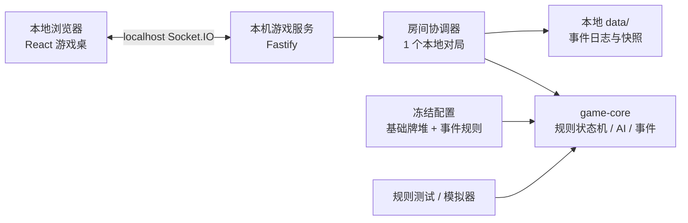

# Chews Freedom / 《营养师之王》本地 MVP 工程计划

**文档状态：** 当前实施计划，取代此前“先联网”的 MVP 顺序  
**基础规则来源：** `Chews_Freedom_V2_Codex_Spec.md`，版本 `2.0-codex-1`  
**本地 MVP 规则版本：** `3.0-local-mvp-draft.2`（见第 4 节的改动说明）  
**交付目标：** 在一台电脑的浏览器中运行完整游戏；0--4 名真人本地游玩，其余座位由 AI 补齐；所有牌明牌可见  
**更新日期：** 2026-07-16

---

## 1. 这次调整后的结论

第一阶段不做联网房间、邀请码、账户、线上匹配或服务器部署。先交付一个**可在本机启动的完整网页游戏**：打开浏览器即可开始一局，能选择真人与 AI 座位，包含规则、事件、计分、结算、卡牌视觉与完整测试。

“本地”不等于把规则散落在前端。项目依然保留一个本机运行的后端进程作为唯一裁判：它洗牌、保存状态、执行 AI、校验动作、写日志；网页只负责展示和发出操作请求。这样本地版稳定后，联网版只是替换连接和持久化层，不必重写游戏规则。

本项目的分工也明确如下：

| 角色 | 主要责任 |
|---|---|
| 你（甲方/设计负责人） | 反馈桌面感觉、卡牌风格、事件内容、文案、目标用户和玩法体验；确认会改变规则的选择 |
| Codex（开发负责人） | 设计架构、编写前后端与 AI、自动测试、代码审查、自己运行验证、修复问题、提供可启动版本和易懂说明 |

你不需要检查代码来保证质量。我每次交付前都需要自己完成规则单测、模拟/回放检查、前后端构建和真实浏览器流程测试；你只需要用“能否玩、是否好看、是否符合你的设计目标”来给反馈。

## 2. 本地 MVP 的产品边界

### 2.1 必须交付

- 一个本地网页游戏：一条命令启动，自动打开浏览器；最终为 macOS 提供双击启动的 `start-local.command`；
- 开局页可将 4 个固定座位分别设为“真人”或“AI”；未满 4 名时由标准 AI 自动补齐；全 AI 模式可用于观看和回归测试；
- 全部 4 位玩家的三张手牌、卡牌数值、角色、患者总值、得分、菜地和当前规则原因始终公开；
- 完整的基础回合流程：发牌、危险患者判定、两名营养师救援、患者互助、菜地、自救结算、弃牌、重洗、计分、结束；
- 完整的事件系统：每轮至多一张事件、两阶段随机抽取、单轮有效、一次性事件池、可视化解释、影响记录、AI 决策和回放；
- 统一的卡牌与桌面视觉系统，包括食物卡、菜地卡、角色标识、事件卡、状态卡、结算界面和移动端布局；
- AI 可独立操作任意空座位；全 AI 模式可用于观看一局和测试规则；
- 可重新开始、查看本局事件时间线、导出本地日志；程序重启后可恢复最近一局或从头开始；
- 中文优先、儿童友好、键盘可操作、数值不只用颜色表达。

### 2.2 这期明确不做

- 私密房间、邀请码、账户、好友、线上匹配、观战、跨设备实时同步；
- 支付、商城、排行榜、赛季、社交关系或聊天；
- 原生桌面/手机 App；本期是本地网页应用；
- 需要线上数据库、Redis、云部署或用户个人信息收集；
- 未经你确认的医学建议、疾病知识结论、食物文案或事件数值。

联网功能会在本地 MVP 验收后作为下一阶段加入。届时会复用规则核心和桌面 UI，而不是推倒重来。

## 3. 本地运行体验

启动后的用户流程应当简单到不需要开发经验：

```text
双击“启动本地游戏”
        ↓
浏览器打开 http://localhost:5173
        ↓
选择 4 个座位中的真人 / AI，并点击“开始这一局”
        ↓
所有手牌明牌展示；真人按提示选择，AI 自动行动
        ↓
查看结算、规则解释与事件时间线；可再开一局
```

开发阶段也保留一条标准命令：

```bash
pnpm install
pnpm dev
```

发布给你试玩时，我会提供 `START_HERE.md`、双击启动脚本和常见问题说明，不要求你使用终端或理解 Node.js。

## 4. 规则版本、继承与改动

### 4.1 不变的 V2 基础规则

除本节明确覆写的内容外，本地 MVP 必须继承 V2 的以下核心规则：

| 主题 | 继承规则 |
|---|---|
| 固定座位 | 永远存在 Seat 0--3 四个位置；角色按顺时针轮换 |
| 角色关系 | 当班营养师、对面助理、顺时针患者 `patient_1`、逆时针患者 `patient_2` 的映射不变 |
| 牌堆 | 48 张主牌、数值分布、3 张手牌、每轮 12 张、每 4 轮正常重洗不变 |
| 救援 | 每次只能救当前最危险患者；并列优先 `patient_1`；不能改救较轻患者 |
| 合法性 | 一换一后目标患者必须达标；营养师自己的总值不影响救援合法性 |
| 患者互助 | 两名营养师后仍有人不达标才可最多互换一次；两名患者均达标则禁止换牌刷分 |
| 计分 | 营养师成功各 1 分；患者双达标各 2 分、单达标各 1 分；分项累计 |
| 菜地身份 | 菜地是独立公共资源，临时 0 值菜卡绝不能进入 48 张主牌 |
| 可重放 | 固定随机种子、卡牌 ID、命令、事件与版本都必须记录 |

### 4.2 四人不足时由 AI 补位

“固定 4 人”表示固定 4 个**座位**，不表示必须有 4 位真人。开局时每个座位都选择一个控制者：`HUMAN` 或 `AI`。

- 0--4 名真人均可开始；其余座位自动配置为 AI；
- AI 也参与抽牌、角色轮换、计分、患者互助和菜地结算，和真人完全遵守同一套规则；
- 基础救援与患者阶段使用 `CANONICAL_COOPERATIVE_POLICY_V2`；有事件时使用冻结在事件定义中的 AI 策略；
- 当轮到 AI 时自动播放其思考/行动结果，玩家可在设置中选择“标准”或“快速”动画；
- 真人座位允许手动操作；所有牌明牌，不存在 AI 读取真人看不到的隐藏信息；
- 不允许少于 4 个座位或增加第 5 个座位。人数变化只改变谁控制座位。

### 4.3 最后一颗菜：本地 MVP 的新终局规则

原 V2 规定：即使最后一颗菜仍救不全患者，也要替换并完成当前轮，之后结束。你的新要求不采用这个行为。

本地 MVP 暂定采用以下明确规则，代号 `L-VEG-01`：

1. 当菜地只剩 **1 颗菜** 时，先枚举该菜可替换的主牌；
2. 只有某一种替换能使当轮所有仍未达标患者在替换后**全部达标**时，才真正消耗并替换最后一颗菜；
3. 若最后一颗菜无论替换哪张牌都不能令所有仍未达标患者全部达标，则不执行这次最后替换，记录 `LAST_VEGETABLE_INSUFFICIENT`，并直接跳到本轮结算；
4. 结算依次执行已经产生分数的 `SCORE_COMMIT` 与 `DISCARD`，随后进入 `GAME_OVER`；不再发生玩家动作、其他菜地操作或新的事件。菜地卡本身始终为 0 分，此前已产生的营养师/患者互助得分保留，不存在“因为最后失败而倒扣已获得分数”；
5. 游戏结束画面必须明确显示：“菜地最后一颗菜无法让所有患者达标，本局结束”，并展示当时所有患者的手牌与总值。

这是一项核心规则变化，因此本地 MVP 不再能直接使用原 V2 的完整游戏长度和菜地消耗统计作为验收数字。实现前会为 `L-VEG-01` 编写专项案例，并在事件规则冻结后重新生成这版的 Monte Carlo 统计。

**已确认的结算语义：** 最后一颗菜不能救全时，不发生最后替换，直接执行本轮结算后结束；两名营养师和患者互助此前已获得的分数保留。

### 4.4 事件成为 MVP 必做项：新的网页版抽取规则

我已读取《营养师之王_桌游企划书_V2_最新版》的第六节。它列出 10 种事件：感冒、复诊日、聚会（蛋糕）、分零食、超市补货、菜单更新、风暴（减产）、下雨（增产）、营养师培训、旅行模式。该 Word 草案中的具体数值仍为空。

以下是你刚确认、并覆盖 Word 草案旧机制的本地网页版规则：

1. 每一轮在**发牌前**只进行一次事件判断；结果只能是“本轮无事件”或“本轮恰好 1 张事件”；
2. 不存在两个事件同时生效，因此不设计事件优先级；
3. 所有事件只在抽到它的**当前轮**有效；风暴、下雨和旅行模式也不再永久或跨 3 轮持续；
4. 每张事件卡在一局中最多出现一次。抽到后立即移出独立事件池，之后不洗回、不重复；10 张事件都用尽后，余下回合自动为无事件；
5. 事件以“两阶段随机”产生：先判断本轮**是否发生事件**，再从尚未出现的事件卡中选择**是哪一张**。这两个依据必须是独立配置，不能混成一个随机数；
6. 如某张事件需要玩家在本轮达成指定解决条件，而结算时未能解决，则记录 `EVENT_UNRESOLVED_GAME_OVER`，完成本轮已发生得分的结算后结束游戏；具体“解决条件”和检查时点必须在该事件定义中写明；
7. 事件在发牌前揭示，但它可以预先登记本轮的受控效果。例如“聚会（蛋糕）”可在发牌前揭示、在发牌后按冻结规则执行一次替换；这不是第二张事件，也不会改变“每轮仅一张”的限制。

因此，Word 中“棋盘/骰子触发”“部分事件永久”“旅行模式 3 轮”“多触发时优先级”等内容仅作为实体桌游草案保留，不进入本地网页版 MVP。

#### 事件抽取流程

```text
ROUND_START
  -> 若事件池为空：本轮无事件
  -> 否则执行 occurrence roll：本轮是否发生事件？
       -> 否：本轮无事件
       -> 是：按 selection weight 从剩余事件池抽取 1 张
              -> 立刻移出事件池、展示事件卡、建立本轮 RoundModifier
  -> DEAL
  -> 仅执行该 RoundModifier 允许的阶段效果
  -> ROUND_END：移除该事件的所有本轮效果
```

`occurrence roll` 决定“这一轮有没有事件”；`selection weight` 决定“有事件时较常抽到哪张”。前者控制总体出现频率，后者控制不同事件的相对出现频率。两个字段的具体数值由你确认后写入配置，并随随机种子记录。

#### 每张事件必须补齐的字段

| 字段 | 当前网页版规则 |
|---|---|
| `event_id` 与显示名称 | 使用上述 10 张事件的固定 ID；可另定中文卡面文案 |
| `reveal_at` | 固定为 `BEFORE_DEAL`，不允许改为其他回合抽取点 |
| `effect_steps` | 可登记为发牌前、发牌后或救援前的本轮内部效果；仍然只属于同一张事件 |
| `occurrence` | 全局每回合是否出现事件的规则/概率；与卡牌选择权重分开 |
| `selection_weight` | 在剩余事件池中抽到该事件的相对权重 |
| `duration` | 固定为 `CURRENT_ROUND`；回合结束自动失效 |
| `consumed_on_draw` | 固定为 `true`；本局绝不重复出现 |
| `effect` 与数值 | 阈值、加牌、菜地变化、重抽/弃牌数量、培训特权等；目前仍空，不能自行编造 |
| `resolution_requirement` | 无需解决，或本轮必须满足的条件；未满足即按第 6 条结束游戏 |
| `failure_check_phase` | 该条件在哪个阶段检查；默认 `END_CHECK`，特殊规则需明确指定 |
| `player_choice` 与 `ai_policy` | 是否需要选目标/同意，AI 怎样确定性处理 |
| `medical_content_source` | 医学、教育与卡面文案的确认来源 |

事件配置一经确认，必须和基础规则一起冻结为 `3.0-local-mvp.2`；任何改动都生成新版本与新平衡统计。事件未配置完整时，启动页要明确显示“事件规则尚未冻结”，不允许把不完整版本称为可验收 MVP。

## 5. 技术方案：本地前后端，但不引入线上复杂度

### 5.1 推荐栈

| 层 | 本地 MVP 选择 | 原因 |
|---|---|---|
| 语言与项目管理 | TypeScript、Node.js 22、pnpm workspace | 一种语言覆盖规则、后端和网页；依赖与命令统一 |
| 前端 | Vite + React + TypeScript | 启动快、适合单一游戏桌面，不为本地 MVP 引入不需要的服务端页面框架 |
| 本地后端 | Fastify + Socket.IO | 即使同一台电脑也走真实命令/事件流；以后上线时不必重写协议 |
| 规则引擎 | 独立的纯 TypeScript `game-core` 包 | 所有规则、AI、事件、随机数与回放均可脱离浏览器测试 |
| 本地保存 | JSON 事件日志 + JSON 快照，原子写入本地 `data/` 目录 | 零数据库安装负担；足够保存最近对局、导出日志和崩溃恢复 |
| 配置校验 | Zod | 在游戏开始前拒绝缺少事件字段、非法卡值、重复事件 ID 或不合法的事件阶段 |
| 自动测试 | Vitest、fast-check、Playwright | 覆盖规则、属性、AI、回放与真实浏览器流程 |
| 发布体验 | `start-local.command` + `START_HERE.md` | 面向没有开发经验的本地试玩者 |

本期不安装 PostgreSQL、Redis、Docker 或云服务。这些会在联网阶段再加入。JSON 本地保存层通过一个明确的 repository 接口隔离，之后可以无痛替换为数据库。

### 5.2 本机架构



**权威状态流：** 网页提交命令 -> 本机服务校验控制者、阶段、合法动作与版本 -> `game-core` 输出下一状态和事件 -> 本机保存快照/日志 -> 网页按服务端状态刷新。即使所有内容在同一电脑，也不允许 React 组件直接修改牌局状态。

### 5.3 计划目录

```text
chews-freedom-local/
  apps/
    web/                       # Vite + React 本地网页
    local-server/              # Fastify + Socket.IO 本机后端
  packages/
    game-core/                 # 卡牌、阶段机、AI、事件、回放、不变量
    protocol/                  # Socket 命令与事件 schema、错误码
    ui/                        # 卡牌、圆桌、按钮、无障碍组件
    test-fixtures/             # V2、L-VEG-01、事件的可读测试局面
  config/
    base-game.json             # 冻结的 48 张牌与基础计分
    events.json                # 10 张一次性事件、出现率、选择权重与本轮效果
  data/                        # 本机生成；不放入版本库
  docs/
    START_HERE.md
    EVENT_RULE_WORKSHEET.md
  scripts/
    start-local.command
```

## 6. 游戏状态机、事件与 AI

### 6.1 本地单局状态机

```text
SETUP
  -> ROUND_START
  -> EVENT_DRAW_BEFORE_DEAL (0 或 1 张，抽后移出事件池)
  -> EVENT_EFFECT_BEFORE_DEAL (如该事件定义需要)
  -> DEAL
  -> EVENT_EFFECT_AFTER_DEAL (仍为同一张本轮事件)
  -> INITIAL_ASSESSMENT
  -> EVENT_EFFECT_BEFORE_ACTIVE_RESCUE (仍为同一张本轮事件)
  -> ACTIVE_RESCUE
  -> ASSISTANT_RESCUE
  -> PATIENT_SWAP
  -> VEGETABLE_RESOLUTION
  -> SCORE_COMMIT
  -> DISCARD
  -> GAME_OVER (若 LAST_VEGETABLE_INSUFFICIENT 或 EVENT_UNRESOLVED_GAME_OVER)
  -> EXPIRE_CURRENT_ROUND_EVENT
  -> END_CHECK
  -> next ROUND_START | GAME_OVER
```

每一步都写出可读的事件，例如 `CARDS_DEALT`、`STRICT_TARGET_SELECTED`、`AI_ACTION_EXECUTED`、`EVENT_DRAWN`、`EVENT_EFFECT_APPLIED`、`EVENT_EXPIRED`、`LAST_VEGETABLE_INSUFFICIENT`。游戏结束后拒绝任何新命令。

### 6.2 人类与 AI 的控制权

| 阶段 | 人类座位 | AI 座位 |
|---|---|---|
| 营养师救援 | 点击自己的牌，再点击严格目标患者的牌；网页只高亮合法组合 | 等待简短动画后执行规范策略 |
| 患者互助 | 两位真人各自选择交出的牌/跳过；若一方是 AI，则 AI 立即作出其选择 | 使用事件无关的标准患者策略，或已冻结的事件专用策略 |
| 菜地 | 不要求玩家手动算最优替换；展示计算过程 | 由引擎按当前规则自动结算 |
| 事件选择 | 仅当经批准的事件定义为“需要选择”时开放对应 UI | 只按该事件卡定义的 AI 策略行动 |

患者互助采用“双方锁定”协议：两名控制者都提交一张牌才交换；任意一方跳过则跳过。真人与 AI 混合时，AI 的锁定动作可见，避免玩家不清楚发生了什么。

### 6.3 事件系统的实现标准

事件必须是数据驱动的，不能把每个事件零散地写在 React 页面里。每个事件至少符合：

```text
EventDefinition {
  eventId: string
  display: { name, summary, illustrationKey, accessibilityText }
  revealAt: BEFORE_DEAL
  effectSteps: typed, validated phase effects for this one event
  selectionWeight: positive number
  duration: CURRENT_ROUND
  consumedOnDraw: true
  resolutionRequirement?: typed condition
  failureCheckPhase?: Phase
  playerChoice?: typed choice schema
  aiPolicy?: deterministic policy name
  logTemplate: string
}
```

规则核心每轮最多加载一张事件，按其 `effectSteps` 在允许阶段执行、在回合结束统一过期，并在回放中重现完全相同的抽取和效果。事件若改变阈值，必须在初始判断之前锁定；事件若加减菜地，必须写明是否可以触发 `L-VEG-01`。不需要、也不允许事件优先级逻辑。

## 7. 明牌桌面与卡牌视觉方向

### 7.1 明牌是确定需求

整局始终公开所有牌：4 位玩家的全部手牌、卡值、事件、菜地、弃牌数、患者总值和分项得分都在桌面上可见。`GameView` 不做按座位遮蔽，也不依赖“只看自己手牌”的交互。

这不是临时 UI 假设，而是本地 MVP 的玩法：玩家共同算数、讨论救援，并能看清 AI 为什么执行某一步。以后如要增加暗牌模式，必须新建模式、重新设计 AI 与平衡测试，不能在现有明牌模式上简单加遮罩。

### 7.2 视觉概念：第三轮温暖手绘方向

第一轮与第二轮分别保留为布局和配色对照，但都不再作为正式美术基准。第二轮解决了土黄和高饱和问题，却因为雾灰、玻璃与规整几何过多，产生了医院和车间感。第三轮概念稿为 `Chews_Freedom_Visual_Concepts_Handdrawn.html`，保留已经认可的四人桌布局，只比较三套手绘美术语言。

用户提供《饥荒》作为参考。项目只提炼不规则墨线、粗糙边缘、纸张肌理、手绘排线和略微夸张的比例等一般美术方法，不复制其角色、界面、图标、字体或恐怖叙事。所有方法都要转译为温暖、低压、适合儿童的家庭绘本氛围。

| 方向 | 第三轮核心画面 | 适用判断 |
|---|---|---|
| A. 暖木墨彩 | 日间家庭厨房、木桌、植物、低饱和水彩块和中等粗细墨线 | 温暖、艺术感和规则清晰度最平衡，当前工程推荐方向 |
| B. 暮色灯下绘本 | 暮色窗景、较重墨线和集中在桌面的吊灯暖光 | 戏剧性与奇趣感最强，但暗部必须控制，避免让儿童紧张 |
| C. 彩铅菜园日记 | 更轻的线条、鼠尾草绿植物和明亮纸张，像亲子共同完成的彩铅绘本 | 最温馨、年龄感最低，适合偏教育和亲子共同参与的版本 |
| D. 奇趣家庭手稿 | 倾斜木桌、原创人物剪影、散落食物、弯曲引导线和叠压纸条组成完整手绘场景 | 彻底取消传统网页顶栏与镜像餐盘，艺术感最强，作为新的工程推荐方向 |

A/B/C 使用相同布局，用于比较线条、色彩、光线与情绪。D 保留相同规则信息和四人关系，但主动打破中心对称与面板网格，用来验证更接近场景插画的最终方向。

### 7.3 第三轮共用视觉语言

正式视觉关键词改为“温暖、手绘、家庭感、奇趣、可信、不过度幼稚”。画面要像一本可以被操作的家庭绘本，而不是医疗界面、工业操作台或扁平教育课件。

- **场景层级：** 每个主画面包含手绘墙面与窗景、木桌与家具、食物与纸张状态三层；吊灯、窗帘、收纳架和绿植建立真实生活空间；
- **构图系统：** 不使用整齐三段式顶栏、四个镜像餐盘或正中心圆桌；允许角色与食物轻微叠压、桌面倾斜、引导线弯曲，但关键数字必须拥有稳定位置和足够对比；
- **线条系统：** 主要物件使用 2-4px 深灰褐墨线，轮廓允许轻微抖动、错位双线和不完全对称；文字和关键数字保持稳定，不对文字使用变形滤镜；
- **材质系统：** 纸张噪点、彩铅排线、水彩色块、木纹和手工剪纸阴影共同建立深度；取消大面积玻璃、金属和光滑工业面板；
- **温暖调色：** 暖纸白 `#F4EEE5`、深墨灰 `#383A35`、胡桃木 `#A97B5F`、鼠尾草绿 `#7F9278`、灰蓝 `#7F959B`、低饱和珊瑚 `#C87567`；灯光可少量使用柔和麦色 `#E5C987`，但不作为大面积背景；
- **风险表达：** 珊瑚色只用于当前需要帮助的患者、失败风险与不可逆提示，同时保留文字、数字和轮廓变化，不能只依靠红色；
- **字体：** 标题优先评估开源的霞鹜文楷或同类人文手写字体，正文继续使用 Noto Sans SC；手写字体只用于品牌、标题和角色签条，规则与数字不使用难辨认的手写字；
- **动效：** 事件纸条在揭示时轻轻落定，可操作食物在悬停或选中时抬起，交换时沿短弧线移动；背景不持续晃动，提供减少动效与跳过结算动画；
- **移动端：** 次要家具和纸张纹理可以降级，关键墨线、食物轮廓和数字对比必须保留；点击目标不小于 44x44px。

### 7.4 食物与场景资产规范

第三轮概念已经用原创 SVG 手绘食物替换 emoji，用于验证墨线、排线、色块和缩放清晰度。正式 MVP 采用“矢量轮廓 + 少量栅格纹理”的混合资产方案：

- 为配置中的每一种食物绘制统一墨线、左上方暖光和低饱和本色，轮廓可夸张但必须保持一眼可辨；
- 每种食物提供普通、可交换、已选中、不可操作四种程序化状态，状态由抬升、外轮廓、图标与文字共同表达；
- 食物本体与数值标签分层，数值不能烘焙进插画，便于无障碍、规则变化和多语言；
- 场景拆成墙面、窗景、家具、桌面、灯光、纸张纹理和前景装饰层，移动端可关闭噪点与次要家具以控制性能；
- 事件插画与食物共享墨线和上色方式，但必须有独立剪影，不能只换一个颜色或文字；
- 角色表现不使用病床、白大褂、针筒等医疗刻板符号，用姓名、角色签条和中性头像表达身份；
- 任何参考游戏的角色剪影、服装、图标、字体和 UI 边框都不得进入正式资产，最终美术必须保持可独立识别的原创性。

### 7.5 食物、菜地、事件与状态组件

| 卡牌类型 | 正面结构 | 视觉与交互要求 |
|---|---|---|
| 食物主牌 | 大数值、食物插画/批准名称、类别角标、唯一卡牌 ID | 0/1/2/3/5/7/9 数值第一眼可读；不能只靠色彩区分；选中和可交换状态清楚 |
| 菜地临时卡 | 大型 `0`、蔬菜图形、`本轮替换` 标签 | 明确是临时卡，结算后离场，不让人误解为新主牌 |
| 事件卡 | 图标、标题、短效果句、`本轮有效` 标记 | 每轮最多展示 1 张；揭示动画后显示当前轮影响，结算后离场且本局不再出现 |
| 角色牌/标识 | 当班营养师、助理、患者 1、患者 2 | 角色和顺时针关系可见，不用性别化或医疗化刻板印象 |
| 状态卡 | 当前阶段、严格目标、菜地余量、AI 思考 | 用一句人话解释“现在为什么只能这样操作” |

视觉 MVP 的验收不是“有几个彩色矩形”，而是交付：暖色手绘 token、完整家庭场景与桌面层级、全部食物手绘资产、7 种主牌值样式、菜地对象、事件对象、角色签条、选中/禁用/风险状态、结算画面和窄屏版本。具体食物名称、健康科普文案与最终字体授权必须等你确认内容来源后再定稿。

## 8. 测试与质量责任

### 8.1 Codex 必做的自动验证

- 将 V2 的 T01--T15 转成可读的单元测试；保留未改变规则的全部边界；
- 新增 `L-VEG-01` 测试：最后菜能救全、最后菜不能救全、最后菜只救一人、此前得分保留、日志/重放一致；
- 用属性测试检查主牌 48 张守恒、菜地临时卡不回流、手牌数量、阶段授权、分项得分、AI 与真人使用同一合法动作表；
- 每一种事件至少有：事件出现/不出现、一次性抽取不重复、单轮过期、无并发事件、非法配置拒绝、AI 选择、未解决结束和回放的测试；
- 固定种子重放必须得到相同最终状态哈希；导出日志后在新进程中也能重建；
- Playwright 自动打开本机网页，覆盖 1 人+3 AI、2 人+2 AI、4 人本地、全 AI、刷新恢复、错误命令拒绝、结束后再开一局；
- 每次交付前运行类型检查、格式检查、单测、浏览器端到端测试和生产构建；不把“应该能运行”当作完成。

### 8.2 平衡统计的正确使用

原始包中的 500,000 轮与 30,000 局统计只适合无事件、原 V2 菜地终局规则。它们会保留为“基础兼容层”回归参考，但不能证明新版正确。

在事件表和 `L-VEG-01` 冻结后，我会生成并保存本地 MVP 自己的：

- 每种事件的出现频率、抽取权重结果与本轮影响；
- AI 与真人座位混合时的完成率、局长、菜地耗尽原因；
- 每个固定座位的角色与得分分布；
- 最后一颗菜失败的次数、当时状态与结束原因；
- 规则版本、配置摘要、随机种子与 AI 策略元数据。

统计用于发现实现错误或体验失衡，不能替代你对“玩法是否有趣、事件是否合理、卡牌是否易懂”的设计判断。

### 8.3 你看到的验收方式

每一个可试玩版本我会附上一页简短说明：如何启动、这次新增什么、我已跑过哪些检查、希望你重点体验哪些画面/规则、已知限制是什么。你只需按场景试玩并反馈，例如“AI 太快”“7 分卡不够醒目”“这个事件不公平”“圆桌看不懂”，无需读代码或自己定位 bug。

## 9. 分阶段实施顺序

### P0：规则、事件与视觉冻结

产物：`3.0-local-mvp.2` 规则说明、完整事件表、卡牌视觉 mini design system、验收案例清单。

- 你确认第 4.3 节对“最后一颗菜”的解释，或给出替代版本；
- 为每张事件补齐第 4.4 节的字段；尤其确认“本轮有无事件”的出现率规则、事件选择权重、效果数值和未解决时的条件。不用一次写成技术语言，我会把自然语言需求整理为配置和测试；
- 确认目标玩家年龄、卡牌插画调性、食品/事件文案审核来源；
- 确认默认本地人数（推荐 1 人 + 3 AI）和 AI 动画速度；
- 我将这些决定转为版本化配置、规则案例和设计 token，供你最后确认。

### P1：可验证的游戏规则核心

产物：不带漂亮 UI 也能完整跑完一局的 `game-core`、AI、事件引擎、命令行模拟器和测试报告。

- 实现卡牌 ID、洗牌、发牌、角色轮换、完整阶段机、计分、重洗、`L-VEG-01`；
- 实现真人/AI 座位模型和基础规范 AI；
- 实现事件配置验证、单事件两阶段抽取、单轮状态、一次性事件池、事件日志和 AI 接口；
- 写回放器、状态不变量、V2 兼容夹具与新版专项测试；
- 通过自动检查后，才开始把规则接到可试玩桌面。

### P2：本地后端与保存

产物：本机 Fastify 服务、Socket 协议、本地日志/快照保存和恢复。

- 实现创建本地游戏、设置 HUMAN/AI 座位、提交命令、AI 自动推进、重新开始；
- 接入 JSON 日志与快照，实现崩溃/刷新后的最近对局恢复；
- 实现可导出的可读回放日志与明确错误消息；
- 以程序化命令跑完 0--4 名真人的完整对局。

### P3：完整网页桌面与卡牌风格

产物：可在本机浏览器玩完一局的高保真中文桌面与移动布局。

- 按确认的第三轮 A/B/C 手绘方向建立暖色 token、墨线规范、纸张纹理、食物资产、家庭场景、桌面、状态板和动效；
- 制作开局座位设置、游戏桌、AI 行动、事件揭示、患者互助、菜地动画、分项榜单、回放时间线；
- 实现明牌、严格目标高亮、可解释的禁用原因、键盘/读屏和减少动效设置；
- 在窄屏手机浏览器验证点按大小、卡牌可读性和信息层级。

### P4：本地试玩、修复与交付

产物：稳定的本地试玩包、双击启动入口、`START_HERE.md`、测试报告和已知限制清单。

- 我运行完整自动验证，修复规则、AI、保存、渲染和交互问题；
- 你试玩 1 人+AI、多人同屏和全 AI 三种场景，给出设计反馈；
- 根据你的反馈迭代卡牌视觉、动画节奏、事件理解成本和桌面布局；
- 将通过验收的本地规则/配置冻结，再开始联网规划。

### P5：本地 MVP 验收后才开始的联网阶段

产物：独立的联网工程计划和风险评审。

- 将本地 JSON repository 替换为 PostgreSQL，将本地 Socket 连接扩展为房间与重连；
- 增加邀请码、账号/游客身份、座位占用、网络超时、服务端部署和隐私设计；
- 保持 `game-core`、事件配置、AI、卡牌 UI 和回放格式尽可能不变；
- 联网不会提前阻塞本地 MVP 的开发和试玩。

## 10. 当前需要你给设计反馈的三件事

这份计划已经将“本地优先、AI 补位、明牌、事件和卡牌风格”定为方向。为了进入 P0，最有价值的反馈是：

1. **最后一颗菜：** 是否确认“救不全则不替换最后一颗菜，直接结束；此前得分保留”？如果不是，请用一个具体手牌例子说明你希望的结算。
2. **事件：** 先从你最想要的 3--5 张事件开始，用日常语言告诉我“什么时候发生、会发生什么、持续多久、玩家能不能选择”。我会把它们整理成完整可实现规则表。
3. **网页视觉：** 请比较 A/B/C 与新增的 D 奇趣家庭手稿。当前工程推荐以 D 的场景构图为主，吸收 A 的日间暖色和 C 的植物色，并把 B 的戏剧灯光只用于事件揭示与结算。

在这三点明确后，我会开始从 P1 构建可运行的本地前后端，并对实现质量负责。
