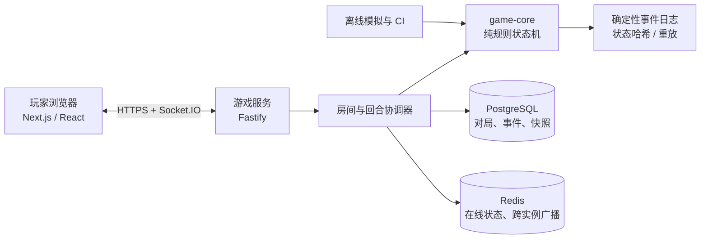

# Chews Freedom V2 / 《营养师之王》线上版工程计划

**文档状态：** 方案草案，待产品与规则负责人确认  
**规则基线：** `2.0-codex-1`  
**适用范围：** 固定四人、无事件的线上联机 MVP；为后续事件、教育内容与商业化保留接口  
**更新日期：** 2026-07-16

---

## 1. 结论与工程方向

本项目应从一开始就采用**服务端权威（server authoritative）**的回合制联机架构，而不是让浏览器各自计算胜负再同步结果。

原因是 V2 有三项不可妥协的规则要求：

1. 每一轮的“最危险患者”是唯一可救援目标，前端不能绕过该限制；
2. 相同随机种子、输入与策略必须得到相同结果，且每局必须可重放；
3. 断线或超时需要由标准 AI 接管，不能让游戏停在半个动作中。

推荐以 TypeScript 单体仓库实现：浏览器负责桌面与操作体验；服务端持有完整牌局、校验命令、生成事件日志；一个不依赖网络和数据库的规则核心负责全部合法性与状态转换。这样既能快速推出 4 人在线版，也能用同一套规则支撑 AI、模拟器、教学回放和未来移动端。

当前工作区只包含规则实现包，没有可扩展的既有应用代码或 Git 仓库。因此本计划按“新建项目”制定，不假定任何现有前后端技术债。

## 2. 已确认的规则边界

以下内容来自 `Chews_Freedom_V2_Codex_Spec.md`、机器配置和参考模拟器，必须成为线上版的验收基线，而不是前端提示文案。

| 规则主题  | 必须落地的行为                               | 工程约束                     |
| ----- | ------------------------------------- | ------------------------ |
| 人数与角色 | 始终 4 人；当班、对面助理、两名患者每轮顺时针轮换            | 房间不满 4 人不得开始；角色由服务端计算    |
| 救援目标  | 每次营养师行动只能处理当前最危险患者；并列时 `patient_1` 优先 | 服务端只生成该目标的合法动作，前端不显示其他目标 |
| 救援合法性 | 一换一后目标患者必须立刻达标；营养师自己的总值不参与判定          | 不能用前端总分或营养师状态拦截动作        |
| 患者互助  | 仅在两名营养师结束后仍有人超标时最多互换一次；两人均达标时必须跳过     | 不得留下“刷分换牌”入口             |
| 菜地    | 独立于 48 张主牌，替换为本轮临时 0 值卡，且不计分          | 临时菜卡不可回流到抽牌堆或弃牌堆         |
| 结束条件  | 菜地从正数降到 0 后，完成当轮动作和计分再结束              | 最后一颗菜的替换与得分必须有效          |
| 可复现性  | 记录规格版本、随机种子、策略、配置摘要、事件日志              | 随机数与规则版本只能由服务端生成和保存      |
| V2 范围 | 事件、骰子、棋盘路线、商业美术、疾病科普数值均未批准            | 不给这些未定内容自行赋值；事件开关固定为关闭   |

参考模拟器的 `--self-test` 已在本地通过。后续实现必须把 T01--T16 及其统计区间迁移为自动化验收，而不是只靠人工试玩。

## 3. MVP 产品范围

### 3.1 本期必须交付

- 创建私密房间、通过短邀请码加入、固定 4 个座位、准备并开局；
- 游客昵称模式；同一浏览器刷新或短暂断线可回到原座位；
- 四人实时同步的回合桌面、手牌、角色、患者总值、菜地、分项得分和阶段说明；
- 当班营养师、助理营养师和患者互助的人工决策；服务端严格校验；
- 操作倒计时、超时后的 `CANONICAL_COOPERATIVE_POLICY_V2` 自动接管；
- 菜地阶段自动按 V2 最少资源/资源不足排序结算，并播放替换过程；
- 对局事件时间线、每轮结算、游戏结束榜单（营养师之王、互救之星、综合得分）；
- 对局完成后的只读回放和可下载的审计日志（仅房主或管理员）；
- 中文优先的可访问性界面：数值不只用颜色表达，键盘可选牌，读屏有清晰的角色和状态标签。

### 3.2 明确不在 MVP

- 未批准的事件、棋盘移动、骰子、商店、付费系统、排行赛季、好友系统；
- 允许少于或多于 4 人的规则变体；
- 未经医学与内容审核的疾病知识卡、营养建议或治疗承诺；
- 观战、大规模匹配、机器人补齐空座、跨局长期账户进度；
- 私密手牌规则变体。它会改变沟通方式与平衡，必须单独定义并重新模拟。

## 4. 推荐技术栈

| 层级 | 推荐选择 | 选择理由 |
|---|---|---|
| 语言与仓库 | TypeScript、Node.js 22、pnpm workspace、Turborepo | 前后端、协议和规则共享类型；构建与测试可独立缓存 |
| 网页客户端 | Next.js + React + TypeScript | 适合房间页、分享入口、回放页和静态说明页；客户端状态集中管理 |
| 实时服务 | Fastify + Socket.IO | WebSocket 房间、重连和确认回执成熟；HTTP 健康检查与管理 API 简洁 |
| 规则核心 | 自建纯 TypeScript `game-core` 包，运行时用 Zod 校验配置与命令 | 不把规则锁进 UI 或 Socket handler；利于单测、模拟和回放 |
| 数据库 | PostgreSQL + Drizzle ORM | 对局、座位、事件与快照适合关系数据和事务；迁移可审计 |
| 进程间实时状态 | Redis | 多实例 Socket 广播、房间 presence、限时锁；不作为最终规则事实来源 |
| 测试 | Vitest、Playwright、fast-check | 覆盖规则单测、属性测试、四浏览器联机流程 |
| 运维 | Docker Compose（本地）+ 容器化部署 + 托管 PostgreSQL/Redis | 先保持部署供应商可替换；WebSocket 生产环境必须支持长连接与会话粘性 |
| 监控 | 结构化 JSON 日志、OpenTelemetry、错误追踪 | 可以定位非法命令、重连、超时 AI 接管和规则版本问题 |

**不建议**在浏览器中直接洗牌、裁决或保存权威状态；也不建议把规则引擎完全绑定在 Colyseus、Socket handler 或 React store 中。实时框架可替换，规则与重放记录不应随之重写。

## 5. 总体架构



### 5.1 权威状态流

1. 浏览器只提交“意图命令”，例如“我用 card-17 换目标患者的 card-04”；
2. 游戏服务检查登录会话、座位归属、房间状态、`expectedRevision`、阶段和操作时限；
3. `game-core` 根据完整状态计算严格目标、合法动作和下一状态；
4. 服务端在一个事务内追加事件、更新状态修订号、按策略推进自动阶段并写入快照；
5. 服务端向四位玩家广播各自可见的 `GameView`，并将命令结果回执给发起者；
6. 客户端只按服务端事件更新画面，不能本地宣告得分或游戏结束。

`expectedRevision` 与 `commandId` 是必需字段：前者拒绝过期操作，后者让网络重试幂等，避免双击或重连导致同一张牌被换两次。

### 5.2 随机性、作弊防护与回放

- 开局由服务端用安全随机源生成一个 64 位或更大的 `seed`，再交由版本化、确定性的 PRNG 洗牌；
- 对局进行中不向客户端公开完整 `seed`、牌堆顺序或其他玩家不应看到的信息；对局结束后可在审计日志展示；
- 每条规则事件保存递增序号、触发命令、规则版本、前后状态哈希和必要的卡牌 ID；
- 每轮结束保存快照；重放时从最近快照重演后续事件，并比较最终哈希；
- `spec_version`、`rules_engine_version`、PRNG 算法版本、策略名和配置摘要必须随对局冻结。规则改动不覆盖历史对局。

## 6. 代码与数据边界

建议的新项目目录如下：

```text
chews-freedom-online/
  apps/
    web/                    # Next.js 客户端
    game-server/            # Fastify、Socket.IO、房间协调
  packages/
    game-core/              # Card、GameState、命令、状态机、AI、重放
    protocol/               # Socket/HTTP schema、DTO、错误码
    ui/                     # 可复用桌面、卡牌、无障碍组件
    test-fixtures/          # T01--T16 与 Python 基准生成的固定夹具
  infra/
    docker-compose.yml
    migrations/
  docs/
```

### 6.1 `game-core` 的最小公开接口

```text
createGame(input, seed, frozenConfig) -> GameState
getGameView(state, viewerSeat) -> GameView
getLegalActions(state, actorSeat) -> LegalAction[]
applyCommand(state, command, context) -> Transition
runCanonicalAction(state, reason) -> Transition
replay(snapshot, events) -> GameState
validateState(state) -> ValidationReport
```

其中 `Transition` 包含新的不可变状态、领域事件、日志元数据及可展示的动画提示。任何将牌、计分或阶段推进的代码都必须经由 `applyCommand` 或 `runCanonicalAction`，不得被 API 层直接修改。

### 6.2 对局持久化模型

最小数据表：

| 表 | 关键字段 | 用途 |
|---|---|---|
| `game_rooms` | `id`、邀请码、状态、规则版本、seed、revision、active_seat | 房间与当前对局元数据 |
| `game_participants` | `game_id`、`seat`、游客/用户标识、重连令牌哈希、连接状态 | 四个座位与授权 |
| `game_events` | `game_id`、sequence、command_id、事件类型、审计 payload、前后哈希 | 事实日志与回放 |
| `game_snapshots` | `game_id`、sequence、压缩状态、状态哈希 | 快速恢复和审计 |
| `game_reports` | `game_id`、结束原因、轮数、分项得分、耗时 | 运营指标与榜单展示 |

服务端为每局建立串行命令队列；数据库更新通过 `revision` 乐观锁或行锁保护。Redis 只用来广播和追踪在线状态，节点重启后必须能从 PostgreSQL 的快照与事件恢复。

## 7. 联机交互和状态机设计

### 7.1 房间生命周期

```text
LOBBY -> READY_CHECK -> IN_PROGRESS -> ROUND_COMPLETE -> GAME_OVER
  |          |                  |                         |
  +----------+------------------+-------------------------+
          玩家断线：保留座位，重连后获取最新 GameView
```

- 房主创建私密邀请码；4 名不同玩家全部点击准备后才能开始；
- 开局冻结配置、随机种子、起始当班座位和座位名单；
- 某名玩家断线时保留其座位并显示倒计时；轮到该玩家后，超时由标准 AI 执行最优合法动作；
- 全员离线或长时间未开局的房间可由后台过期清理，但绝不删除已结束对局的审计数据；
- MVP 不做“中途换真人玩家”，以免重连令牌和分数归属复杂化。

### 7.2 回合阶段与人机分工

| 阶段 | 操作人 | 前端行为 | 服务端行为 |
|---|---|---|---|
| `DEAL` / `INITIAL_ASSESSMENT` | 无 | 发牌动画、显示患者风险 | 洗牌、固定发牌顺序、计算总值与严格目标 |
| `ACTIVE_RESCUE` | 当班营养师 | 仅高亮严格目标及合法可选牌 | 校验一换一；无合法动作自动跳过 |
| `ASSISTANT_RESCUE` | 对面助理 | 基于更新后的患者状态重新展示 | 重新计算目标，绝不沿用当班目标 |
| `PATIENT_SWAP` | 两名患者 | 协作选择或放弃互换 | 只有仍超标时才开放，最多结算一次 |
| `VEGETABLE_RESOLUTION` | 无 | 动画展示替换与菜地减少 | 按 V2 资源优先级自动结算，0 分 |
| `SCORE_COMMIT` / `DISCARD` / `END_CHECK` | 无 | 展示分项得分和下一轮角色 | 写事件、弃牌、重洗或结束 |

营养师阶段建议 45 秒；患者互助阶段建议 40 秒；首次教学房可配置为 90 秒。时间到达时，服务端记录 `AI_TAKEOVER` 并执行 `CANONICAL_COOPERATIVE_POLICY_V2`，而不是随机弃权。

### 7.3 患者互助的在线协作协议

规则只规定“患者最多互换一次”，没有规定两位真人在线时由谁拥有最终确认权。MVP 推荐采用**双人锁定**：

1. 两名患者各自锁定一张自己要交出的牌，或选择“本轮不互换”；
2. 两人都锁定后，只有“两张牌均已选择”才执行互换；任意一方选择不互换则跳过；
3. 操作前可撤回，锁定后只向对方显示选择状态；倒计时结束仍未完成时，服务端改用标准患者策略；
4. 结算画面明确显示双方牌、结果、共同获得的 0/1/2 分与后续菜地影响。

这是产品协作协议，不改变 V2 的计分与一换一规则。若想让一位患者提案、另一位确认，或完全自动使用标准策略，应在产品决策后替换这一层，而不改动 `game-core` 的患者换牌裁决。

### 7.4 信息可见性（MVP 假设）

建议 MVP 使用**公开手牌**：四位玩家始终能看到全部三张手牌、患者总值、得分和菜地。这最接近面对面教育桌游的共同计算体验，也让营养师和患者能真正讨论救援。

服务端仍应以 `getGameView(state, viewerSeat)` 输出视图，保留未来遮蔽字段的能力。若改为私密手牌，将改变玩家可作决策的信息集合，必须作为新的模式重新定义 AI、超时处理、教学引导和统计平衡，不能只改 CSS 隐藏。

## 8. Socket 协议与错误处理

所有实时命令使用统一信封：

```text
CommandEnvelope {
  commandId: UUID
  expectedRevision: integer
  gameId: UUID
  actorSeat: 0 | 1 | 2 | 3
  type: CommandType
  payload: object
}
```

第一批命令包括：

```text
room.create | room.join | room.ready | game.start
rescue.submit | rescue.pass
patientSwap.lock | patientSwap.unlock
game.requestResync | replay.open
```

服务端事件包括：

```text
game.viewUpdated | game.commandAccepted | game.commandRejected
game.timerUpdated | game.aiTakeover | game.roundResolved | game.ended
```

拒绝结果沿用规则规范中的原因码，并新增网络层原因码：`NOT_YOUR_SEAT`、`STALE_REVISION`、`DUPLICATE_COMMAND`、`ROOM_NOT_READY`、`PLAYER_NOT_RECONNECTED`。客户端要将这些显示为可理解的状态提示，并立即用服务端快照纠正本地画面。

## 9. 游戏桌面与体验原则

线上版不应照搬扑克网站。推荐以一张清晰的圆桌为核心：四位玩家固定在上下左右；当轮角色有醒目但不过度干扰的标识；中央只放当前阶段、两名患者总值、风险差和剩余菜地。

- **操作聚焦：** 轮到营养师时只突出严格目标、自己的三张牌和目标的三张牌；其他牌弱化，降低“为什么不能救另一人”的困惑；
- **可解释性：** 每次自动跳过或动作被拒绝，显示规则原因，例如“患者 1 的超标值更高，因此本次必须先救她”；
- **结算节奏：** 换牌、患者互助、摘菜与得分分步播放，但允许“跳过动画”；
- **儿童友好：** 卡牌用数值、名称、图形符号三重编码；不依赖红绿颜色；文字长度与语音朗读预留 i18n 键；
- **教育与竞争平衡：** 榜单同时展示营养师之王和互救之星，不把综合分唯一化；平局共同获奖；
- **审计与信任：** 对局结束可查看“本轮为什么这样结算”的事件时间线，但不在进行中泄露未来牌序。

视觉、美术、卡面食物文案属于后续内容工作流。游戏核心先使用可替换的占位卡牌主题和经过批准的通用说明文本。

## 10. 测试、验证与发布门槛

### 10.1 规则层

- 将规范 T01--T15 写为确定性单测，覆盖所有阶段、得分分项、严格目标、重洗和菜地耗尽；
- 以参考模拟器生成固定输入/输出夹具，校验相同四手数值下的合法动作、规范策略、得分和菜地需求；
- 用属性测试生成合法状态，持续验证 48 张主牌守恒、临时菜不回流、代币范围、`total_points` 分项相等、阶段授权和命令幂等；
- 使用不同 `seed` 做重放测试：状态快照加完整事件日志必须重建相同最终哈希；
- CI 每次提交运行小样本统计，夜间或发布前运行足量蒙特卡洛回归，检查 T16 指定区间。

### 10.2 联机层

- Playwright 同时启动 4 个浏览器上下文，覆盖建房、加入、准备、发牌、合法换牌、非法换牌、患者互助、结束榜单；
- 模拟刷新、Socket 重连、重复命令、超时 AI 接管和两个并发命令；
- 验证不同座位不会收到不应看到的审计字段；
- 在 Redis 多实例广播环境做房间恢复演练：服务实例重启后从快照和事件恢复对局；
- 压测目标先以“多个独立 4 人房间稳定运行”为准，不承诺大型赛事规模后再做容量设计。

### 10.3 上线前 Definition of Done

- 所有 T01--T16 通过，且官方统计保留规则版本与策略元数据；
- 任何客户端都不能提交“救较轻患者”或重复得分的有效命令；
- 菜地临时卡不进入 48 张主牌，最后一颗菜结算后才结束；
- 一局可从日志完整重放，重放哈希与原局一致；
- 4 名真人可在桌面和移动浏览器完成一局，短暂掉线后可恢复；
- 玩家看得到当前阶段、可行动人、倒计时、拒绝原因和分项得分；
- 事件开关默认关闭，未批准内容在生产配置中无法启用；
- 所有分析与错误日志不记录可直接识别儿童身份的敏感信息。

## 11. 分阶段实施计划

### P0：共同定稿（先做）

产物：产品决策记录、冻结的 MVP 配置和测试验收表。

- 确认公开手牌是否接受；若不接受，停止进入开发并先重写信息规则与平衡策略；
- 确认患者互助采用“双人锁定”还是“提案-确认”；
- 确认游客昵称、账户、房间邀请和重连时长的产品边界；
- 确认视觉年龄段、无障碍要求、医学/教育内容审核责任人；
- 确认部署预算、预计测试人数、地区与数据保留期限。

### P1：规则核心与基准测试

产物：可发布的 `game-core` 包、配置加载器、CLI 模拟器、规则测试报告。

- 把 Markdown 规格与 JSON 配置转为带卡牌 ID 的不可变状态机；
- 实现确定性 PRNG、洗牌、发牌、完整阶段机、规范 AI、菜地不足分配和日志；
- 实现状态验证、命令错误码、重放和 T01--T16；
- 对照参考 Python 模拟器生成夹具与统计报告；
- 评审通过后冻结 `2.0-codex-1` 线上实现版本。

### P2：多人房间与持久化

产物：本地 Docker 环境、HTTP/Socket 服务、数据库迁移、断线恢复演示。

- 实现游客会话、邀请码、准备状态、四座位授权和重连令牌；
- 将 `game-core` 命令映射为串行的服务端事务与 Socket 事件；
- 追加事件、轮末快照、版本/哈希校验、命令幂等和 AI 超时接管；
- 接入 PostgreSQL、Redis、结构化日志与基础健康检查；
- 以无 UI 的 Socket 集成测试验证四人完整对局。

### P3：可玩的网页桌面

产物：桌面与移动端均可完成一局的中文 MVP。

- 制作建房、加入、准备、重连、游戏桌、结算、榜单和回放入口；
- 完成可解释的严格目标高亮、合法选牌、双人锁定与自动结算动效；
- 实施键盘操作、读屏标签、非色彩状态提示和网络异常反馈；
- 用真人试玩校准倒计时、信息密度、动画速度和理解成本；
- 不以试玩反馈直接修改规则；规则改动必须回到版本化与模拟流程。

### P4：试点、稳定性与正式发布

产物：受控测试环境、运行手册、上线回滚方案、试点复盘报告。

- 部署 staging，做重连、服务重启、并发房间和错误注入演练；
- 小范围测试时采集匿名玩法指标：局长、超时率、断线率、非法操作原因、菜地消耗与各角色得分分布；
- 将异常统计与 V2 参考区间对比，区分“实现错误”和“真人策略差异”；
- 完成隐私、内容审核、客服处理与数据清理流程后再发布；
- 新事件或规则变体以新规格版本、独立 feature flag、重新模拟和独立回放兼容策略发布。

## 12. 待共同决策的设计问题

| 问题 | 推荐默认 | 为什么需要现在决定 |
|---|---|---|
| 手牌是否公开 | 公开 | 私密模式会改变策略、教学及平衡，不能仅作为 UI 开关 |
| 患者互助如何确认 | 双人锁定 | 既保留协作感，又避免一名玩家替另一名玩家出牌 |
| 超时时间 | 营养师 45 秒、患者 40 秒、教学房 90 秒 | 影响断线接管、真人体验和测试脚本 |
| 用户身份 | 游客昵称 + 重连令牌 | MVP 能低摩擦试玩；账户、未成年人同意与数据规则后置 |
| AI 范围 | 只做超时接管 | 先验证真人四人体验，再决定是否做补位机器人 |
| 首发终端 | 桌面优先、移动浏览器可用 | 决定圆桌布局、点击面积和动效复杂度 |
| 教育内容 | 仅批准的通用规则说明 | 避免将未审医学信息带入产品 |
| 部署供应商 | 容器与托管数据服务保持可替换 | 在明确预算、地区和预计人数后选择，而非先绑定平台 |

## 13. 下一步

本工程计划可在 P0 决策确认后直接进入 P1。最值得先一起脑暴的不是某个 UI 组件，而是三项会影响整个产品形态的选择：**手牌公开程度、患者互助的确认方式、目标用户年龄与单局时长**。这些明确后，我可以把本计划继续细化为项目脚手架、数据库 schema、Socket 契约和首批开发任务。
