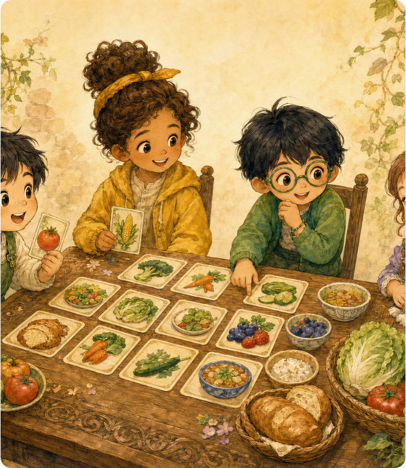

# Chews Freedom

[Play the public game](https://chews-freedom-mvp.vercel.app)



Chews Freedom is an English-language, four-seat cooperative food-card game. Players take turns as **Today's Nutritionist**, **Assistant**, and two **Tyro Friends**, using thoughtful food-card swaps and the Orchard to help everyone reach their protein target.

Chews Freedom is an educational game. It does not provide medical, nutritional, or individual dietary advice.

## Included in this release

- A 48-card food deck with protein values
- Enabled event cards and Orchard fruit cards with zero protein
- Clear, guided phases: Today's Nutritionist, Assistant, Tyro Friend mutual aid, then Orchard
- Optional AI-controlled seats and editable player names
- A one-round interactive tutorial and an in-game rulebook
- Round summaries, score tracking, rotating roles, and a public Vercel deployment

## AI-assisted development workflow

Chews Freedom was created through a **vibe-coding** collaboration: the game creator described the intended player experience, rules, and visual direction in plain language, then reviewed playable iterations and supplied feedback.

- **GPT-5.6** was used to turn the initial concept, Chinese planning materials, and game-rule discussions into an English engineering and game-design plan. It also helped polish the visual direction and illustration brief during later iterations, and organized and edited the introduction video alongside clips generated with Seedance 2.0.
- **Codex** was used to implement the decisions in this repository: the frontend, rules engine, backend/API routes, automated checks, deployment configuration, and iterative fixes based on playtesting feedback.

The game’s rules and creative choices remained human-directed throughout; the AI tools helped structure the plan, build the code, and refine the release.

## How a round works

1. Today's Nutritionist chooses a Tyro Friend to help with one food-card swap.
2. If needed, the Assistant can help either Tyro Friend with a second swap.
3. If needed, both Tyro Friends may make one mutual-aid swap.
4. If a target is still not met, the Orchard supplies zero-protein fruit cards for additional swaps.

The game presents the active phase, eligible cards, and the next required action throughout play. Event cards remain enabled.

## Run locally

```sh
pnpm install
pnpm dev
```

Open [http://127.0.0.1:5173](http://127.0.0.1:5173).

## Verify the project

```sh
pnpm test
pnpm build
```

## Deployment

The live game is deployed on Vercel at [chews-freedom-mvp.vercel.app](https://chews-freedom-mvp.vercel.app). The deployed app uses the same rules engine through `/api/*`.

Each browser keeps its own game state. Selecting **New Game** or clearing browser data starts a new local game. The current release is not real-time multiplayer; invite rooms and cross-device shared games would need persistent storage.

## Project structure

- `src/` - React interface, game types, card data, styling, and final illustrated assets
- `server/` - local Fastify server and rules-engine tests
- `api/` - Vercel serverless API routes for the public deployment
- `vercel.json` - Vercel build and API routing configuration
